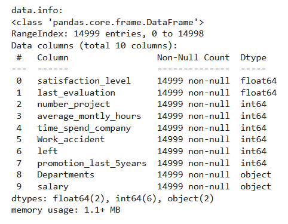
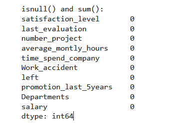
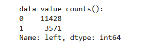
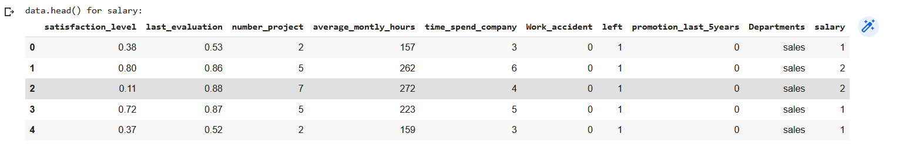
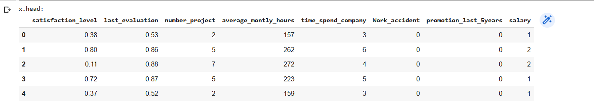
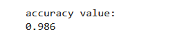

# Implementation-of-Decision-Tree-Classifier-Model-for-Predicting-Employee-Churn

## AIM:
To write a program to implement the Decision Tree Classifier Model for Predicting Employee Churn.

## Equipments Required:
1. Hardware – PCs
2. Anaconda – Python 3.7 Installation / Jupyter notebook

## Algorithm
 
    step1-start

    step2-Import the required libraries.

    step3-Upload and read the dataset.

    step4-Check for any null values using the isnull() function.

    step5-From sklearn.tree import DecisionTreeClassifier and use criterion as entropy.

    step6-Find the accuracy of the model and predict the required values by importing the required module from sklearn.

    step7-end


## Program:

/*
Program to implement the Decision Tree Classifier Model for Predicting Employee Churn.


Developed by: R suraj pandian


RegisterNumber:  212223080040
*/
```python

import pandas as pd
data=pd.read_csv("/content/Employee.csv")

print('data.info:')
data.info()

print('data.isnull().sum():')
data.isnull().sum()

print('value_count: ')
data["left"].value_counts()

from sklearn.preprocessing import LabelEncoder
le=LabelEncoder()

data["salary"]=le.fit_transform(data["salary"])
data.head()

*x=data[["satisfaction_level","last_evaluation","number_project","average_montly_hours","time_spend_company","Work_accident","promotion_last_5years","salary"]]
x.head()**

y=data["left"]

from sklearn.model_selection import train_test_split
x_train,x_test,y_train,y_test=train_test_split(x,y,test_size=0.2,random_state=100)

from sklearn.tree import DecisionTreeClassifier
dt=DecisionTreeClassifier(criterion="entropy")
dt.fit(x_train,y_train)
y_pred=dt.predict(x_test)

from sklearn import metrics
accuracy=metrics.accuracy_score(y_test,y_pred)
accuracy

dt.predict([[0.5,0.8,9,260,6,0,1,2]])

```

## Output:














## Result:
Thus the program to implement the  Decision Tree Classifier Model for Predicting Employee Churn is written and verified using python programming.
